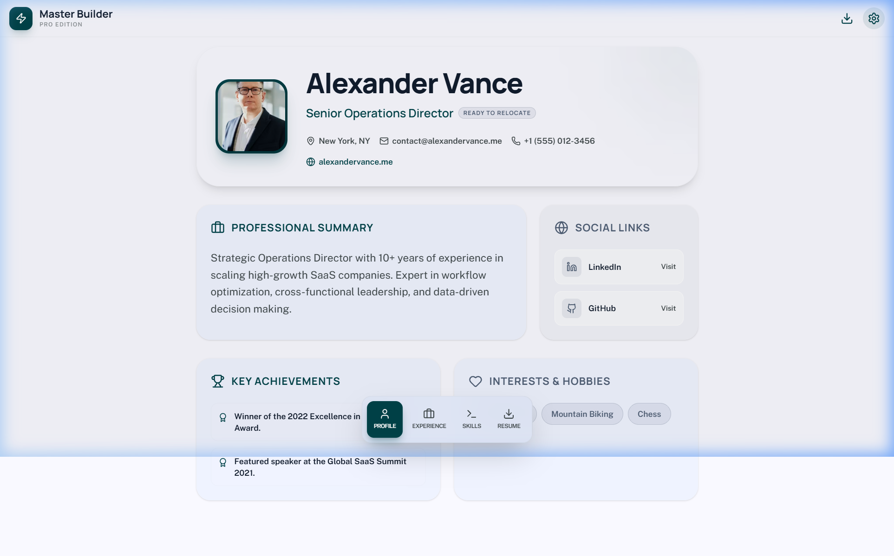

# 🚀 Master Builder Pro - Premium Resume Portfolio

[](https://resume-lovat-six-12.vercel.app/)
[](https://react.dev/)
[](https://tailwindcss.com/)
[](https://www.framer.com/motion/)

A high-fidelity, interactive resume and portfolio builder designed for professionals who want to stand out. Built with a modern **Bento Grid** layout, glassmorphic UI elements, and smooth micro-animations.



## ✨ Key Features

-   **🎯 Interactive Bento Grid**: A beautiful, responsive layout inspired by Apple's modern design language.
-   **🎨 Premium Glassmorphism**: Floating navigation and translucent cards for a futuristic feel.
-   **⚡ Dynamic Sections**: Seamlessly switch between Profile, Experience, Skills, and Resume tabs.
-   **📄 PDF Export**: Professional-grade resume generation ready for download.
-   **🎬 Micro-Animations**: Powered by Framer Motion for a polished, "alive" user experience.
-   **📱 Fully Responsive**: Optimized for desktop, tablet, and mobile viewing.
-   **🛠️ Tech Stack**: React 19, Vite 8, Tailwind CSS 4, and Lucide Icons.

## 🚀 Getting Started

### Prerequisites

-   [Node.js](https://nodejs.org/) (v18 or higher)
-   [npm](https://www.npmjs.com/) or [yarn](https://yarnpkg.com/)

### Installation

1.  **Clone the repository**:
    ```bash
    git clone https://github.com/mannatmohapatra933/resume.git
    cd resume
    ```

2.  **Install dependencies**:
    ```bash
    npm install
    ```

3.  **Run the development server**:
    ```bash
    npm run dev
    ```

4.  **Open in browser**:
    Navigate to `http://localhost:5173`

## 🛠️ Built With

-   **Frontend**: [React 19](https://reactjs.org/)
-   **Build Tool**: [Vite 8](https://vitejs.dev/)
-   **Styling**: [Tailwind CSS 4](https://tailwindcss.com/)
-   **Animations**: [Framer Motion](https://www.framer.com/motion/)
-   **Icons**: [Lucide React](https://lucide.dev/)
-   **Routing**: [React Router 7](https://reactrouter.com/)

## 📜 License

Distributed under the MIT License. See `LICENSE` for more information.

---

Built with ❤️ by [Mannat Mohapatra](https://github.com/mannatmohapatra933)
